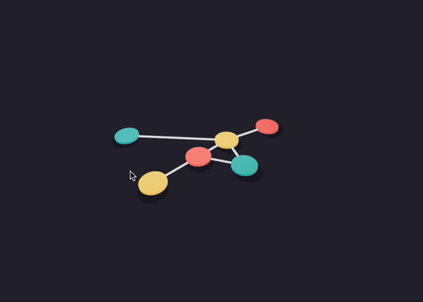

 
[](https://www.npmjs.com/package/graphire) 
[](https://www.npmjs.com/package/graphire)
[](https://www.npmjs.com/package/graphire)

```bash
npm install graphire
```

### What is it?
Graphire is a declarative and unopinionated graph visualization library for React. It supports different layouts to visualize large dynamic networks of nodes and links in both 2D and 3D. 

### How does it work?
Internally it stores the graph using a bidirectional adjacency list that allows fast insertion, deletion, and iteration. It then exposes a `Graph` wrapper and two essential hooks: `useNode` and `useLink`. Those will help you to update the node and links position in an unopinionated way. 

### Unopinionated?
It means that you can choose nodes and links to be anything you like: a `<circle>`/`<line>` (SVGs), `<div>`, `<canvas>`, `<mesh>`/instanced mesh (ThreeJS with R3F). The exposed hooks will only care for positioning. It will be up to you to decide how to display and style the nodes and links. 

### Why?
Some graph/network visualization libraries like D3.js are not made to work with React, hence uncomfortable to use. Other libraries are made for React but do not decouple styling from positioning, making it hard to customize. Graphire solves that. And it's _fast_.


# [Documentation](https://github.com/flavioschneider/graphire/wiki) 

# Examples 

<table>
  <tr>
    <td> 
      <a href="https://codesandbox.io/s/graphire-svg-simple-graph-example-eftpc?file=/src/App.js:184-633"></a>
      Simple example using SVGs without any layout.
    </td>
    <td>
      <a href="https://codesandbox.io/s/graphire-svg-bubble-example-e33ss"></a>
      Bubble example using SVGs with force layout.
    </td>
  </tr>
  <tr>
    <td>
      <a href="https://codesandbox.io/s/graphire-forcelayout-example-jet3q"></a>
      Graph example in 3D with react-three-fiber (Three.js) using very efficient node instancing and segments. 
    </td>
    <td>
      <a href="https://codesandbox.io/s/graphire-drag-drop-r3f-uski3"></a>
      Drag and drop nodes with @use-gesture and react-three-fiber.
    </td>
  </tr>
</table>

# Basic Usage:

1. Use `Node` and `Link`components  (defined in step 2 and 3) inside an svg by using the `Graph` wrapper.

```jsx
import { Graph } from 'graphire'
const MyComponent = (
  return (
    <svg>
      <Graph>
        <Node uid={0} x={110} y={300} color='red'/>
        <Node uid={1} x={50} y={30} color='orange' />
        <Node uid={2} x={150} y={80} color='green' />
        <Node uid='k' x={200} y={200} color='blue' />
        <Node uid={3} x={400} y={100} color='yellow' />

        <Link source={0} target={1} />
        <Link source={1} target={2} />
        <Link source={1} target='k' />
        <Link source={3} target='k' />
      </Graph>
    </svg>
  )
)
```

2. Build the `Node` component using the `useNode` hook.
```jsx 
import { useRef } from 'react'
import { useNode } from 'graphire'

const Node = (props) => {
  const { color='black', radius=5, ...rest } = props
  const ref = useRef()
  useNode(([cx, cy]) => {
    ref.current.setAttribute('cx', cx)  
    ref.current.setAttribute('cy', cy)  
  }, rest) 
  return <circle ref={ref} cx='0' cy='0' r={radius} fill={color} />
}
```

3. Build the `Link` component using the `useLink` hook.
```jsx 
import { useRef } from 'react'
import { useNode } from 'graphire'
// Link 
const Link = (props) => {
  const { source, target, color = 'black', ...rest } = props
  const ref = useRef()

  useLink(([x1, y1], [x2, y2]) => {
    ref.current.setAttribute('x1', x1)  
    ref.current.setAttribute('y1', y1)  
    ref.current.setAttribute('x2', x2)  
    ref.current.setAttribute('y2', y2)  
  }, source, target, rest)
  return (
    <line ref={ref} x1='0' y1='0' x2='0' y2='0' stroke={color} strokeWidth={1} />
  )
}
```


## Goals:
Short-term: 
- [ ] -

Medium-term:
- [ ] Convert to typescript (50% done)

Long-term:
- [ ] Layout circular  
